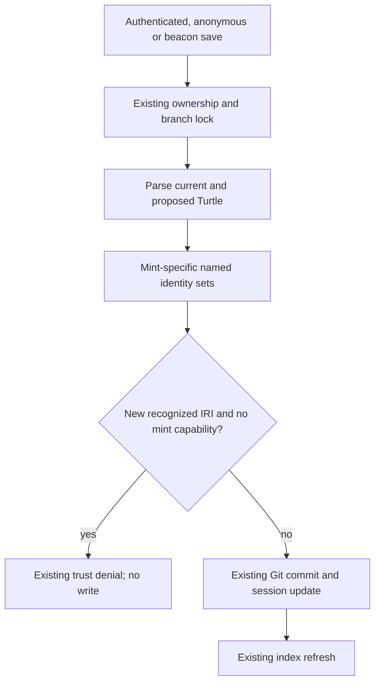

# Individual mint enforcement - Plan

## Goal Capsule

- **Objective:** Contributors without mint permission cannot add new named, typed individuals through suggestion saves.
- **Means:** Extend the existing branch-content authorization check with mint-specific RDF identity recognition.
- **Authority:** Existing TrustService policy and the Product Contract below govern behavior. This is D04 under B14 of the OntoKit web requirements delivery roadmap.
- **Execution:** Test-first implementation in ontokit-api, followed by review, repository checks and a PR to `dev`. The delivery orchestrator owns publication and integration under standing authorization.
- **Stop condition:** Escalate only a proven conflict with existing trust policy or an unavailable prerequisite that cannot be resolved locally. D05 and deployment acceptance remain separate.

---

## Product Contract

### Summary

Apply the existing mint capability to explicit named individuals and ordinary class-typed named individuals in every suggestion content-save path. Preserve edits to already recognized entities and existing submission behavior.

### Problem Frame

Suggestion saves derive new entities from Turtle rather than trusting a client flag. Their declaration helper recognizes classes and properties but omits individuals. A contributor can therefore add typed individuals despite lacking the capability advertised by TrustService.

### Requirements

- R1. Authenticated save, anonymous save and beacon save reject newly introduced named individuals when the current actor lacks mint permission, using the existing 403 trust-required contract.
- R2. Recognition includes explicit `owl:NamedIndividual` declarations and ordinary class-membership assertions whose class need not be declared locally. Identity is the subject IRI, deduplicated across its types.
- R3. Existing recognized entity IRIs remain editable, including additional types, relationship/label changes and class/property-individual punning. Referenced objects and blank-node identities alone do not count as newly minted named entities.
- R4. Rejected saves preserve Git content/revisions, session metadata/counters and refresh scheduling. Existing parsing, ownership, branch locks, quotas and missing-baseline protections remain effective.
- R5. Trusted/reviewer creation remains permitted; mint authorization changes do not expand submission duplicate validation, billing, namespace policy or the 25-entity validation cap.
- R6. Resumed sessions use their existing branch as the save baseline. Submit/resubmit preserve their existing behavior, including demotion handling; this repair does not retroactively revoke previously stored entities.

### Scope Boundaries

This deliverable repairs the three existing content-write gates. It does not redefine the editor/index entity taxonomy or add OWL inference. Untyped subjects and object-only references are outside this typed-entity detector; it does not claim complete OWL individual discovery.

#### Deferred to Follow-Up Work

D05 handles embedding errors. D02 proves deployed persona workflows. Historical branches created through the old omission, retroactive submit authorization, and general untyped-individual policy remain B14 reconciliation work; no historical branch or entity is deleted by this repair.

### Acceptance Examples

- AE1. A restricted actor appends a new explicit individual while claiming `mints_entity=False`; the save is denied without persisting anything. Covers R1, R4.
- AE2. A restricted actor appends a named subject typed with an external class; the same denial applies. Covers R1, R2.
- AE3. A restricted actor edits an existing individual or adds a type to an existing class IRI; the save remains allowed. Covers R3, R6.
- AE4. A trusted actor adds either individual form; the save succeeds without new duplicate-validation charges at save time. Covers R5.

---

## Planning Contract

### Key Technical Decisions

- KTD1. **Keep mint recognition separate from submission classification.** Extend `_declared_entity_iris` or a dedicated mint helper, leaving `_declared_entities` and its shared class/property set unchanged. The latter controls paid duplicate validation and entity caps. Governs implementation of R1, R2, R5.
- KTD2. **Compare parsed named-IRI sets.** Retain RDFLib Turtle parsing and URIRef identity. Explicit individuals count; ordinary typing counts when its type is a class-membership target rather than an RDF/OWL schema or structural declaration. Use an explicit documented exclusion set, not a whole-namespace blacklist: `owl:Thing` and `owl:Nothing` still express class membership. A structural type must not mask another ordinary type on the same subject. Named subjects typed with blank-node class expressions also count; exclude blank-node subjects, not their named instances. Governs R2, R3.
- KTD3. **Keep authorization at the current branch-relative write boundary.** All three writers already invoke the guard before commit under the branch lock. Changing submission to compare against the default branch would introduce retroactive demotion policy, contrary to the existing resubmit regression. Governs R4, R6.

No alternative architecture requires development: reusing the global index classifier still misses ordinary typing, and broadening the shared submission set would change unrelated policy.

### Assumptions

The bounded repair treats adding the first recognized type to an otherwise untyped subject as minting; otherwise a restricted actor could seed a label and add a type in a later save. Recognition is an application authorization rule, not a semantic assertion that every RDF subject is an OWL individual. Standard ontology metadata, datatype, axiom, restriction and list structure types require exclusions, verified by explicit tests.

### High-Level Technical Design

### Risks and Dependencies

Typed RDF schema resources can resemble individual assertions. KTD2 needs a positive/negative matrix rather than a blanket namespace rule. Parsing both snapshots preserves existing malformed-input behavior. No migration or new dependency is required. Existing API tests use mocked services and some real Git repositories; use both where appropriate to prove R4.

### Sources

- `ontokit/services/suggestion_service.py`: `_declared_entity_iris`, `_declared_entities`, `_assert_branch_content_can_mint`, `save`, `save_anonymous`, `beacon_save`, `beacon_save_anonymous` and their shared `_beacon_flush` gate.
- `ontokit/services/trust_service.py`: `can_mint_entities`; `tests/unit/test_auto_accept_clock.py`: demoted-user resubmit contract.
- `docs/audits/2026-09-05-pr-party-dev-parity-ledger.md`: separate mint, namespace and duplicate-policy seams.
- [OWL declarations and structural consistency](https://www.w3.org/TR/owl2-syntax/#Declarations_and_Structural_Consistency): individual declarations are optional, motivating R2.
- [OWL entity declarations](https://www.w3.org/TR/owl2-primer/#Entity_Declarations): punning motivates IRI identity in R3.
- [RDFLib graph traversal](https://rdflib.readthedocs.io/en/7.1.4/intro_to_graphs.html): parsed term traversal and set deduplication support KTD2.
- [OWASP authorization guidance](https://cheatsheetseries.owasp.org/cheatsheets/Authorization_Cheat_Sheet.html): mutation-boundary authorization and negative tests support R1/R4.

---

## Implementation Units

### U1. Recognize typed individual minting without changing submission policy

**Goal:** Implement the bounded RDF identity rule. **Requirements:** R2, R3, R5. **Dependencies:** None.

**Files:** `ontokit/services/suggestion_service.py`, new `tests/unit/test_suggestion_mint_entities.py`, `tests/unit/test_suggestion_submission_content.py`.

**Approach:** Apply KTD1/KTD2 at the existing extraction seam. Document the schema/structural exclusions next to the helper. Preserve the shared submission classifier.

**Patterns:** Existing Graph parsing, URIRef sets and HTTP 422 parse errors in the suggestion service.

**Execution note:** First reproduce the two omitted individual forms with failing regressions.

**Test scenarios:**

1. Explicit individual, ordinary local/external type, both forms, multiple types and `owl:Thing` each yield one named identity. A named subject typed with an anonymous restriction or union class expression also yields one identity.
2. Existing class/property/individual identity remains the same through added typing and punning.
3. Object-only IRI references, blank-node individuals/restrictions/lists and ontology/datatype/axiom metadata do not create individual identities by themselves.
4. Structural plus ordinary typing still recognizes the named individual; an undeclared custom class remains valid membership evidence.
5. Turtle reordering/prefix aliases retain the same set; malformed Turtle retains HTTP 422.
6. Existing submission classification still excludes individuals and retains class/property behavior.

**Verification:** The new regressions fail on the baseline, then pass; existing submission-validation tests remain green.

### U2. Prove permission and persistence behavior across every save path

**Goal:** Verify the actual service entry points enforce the repaired rule. **Requirements:** R1, R3, R4, R5, R6; AE1–AE4. **Dependencies:** U1.

**Files:** `tests/unit/test_suggestion_trust_integration.py`, `tests/unit/test_suggestion_service.py`, `tests/unit/test_suggestion_submission_content.py`; production service only if integration reveals a necessary correction.

**Approach:** Parameterize established permission fixtures over both individual forms and exercise authenticated `save`, `save_anonymous`, and both public beacon entry points (`beacon_save` and `beacon_save_anonymous`) through their shared `_beacon_flush` gate. Use existing real-Git fixtures for denial persistence where available; retain the unmocked mint guard and isolate external collaborators.

**Patterns:** Existing client-hint bypass and beacon mint-denial tests; existing real-Git malformed-Turtle regression.

**Test scenarios:**

1. Restricted authenticated and anonymous saves deny both new individual forms despite an absent/false client hint, preserving the existing reason payload.
2. Separate authenticated and anonymous beacon-entry tests prove the same enforcement without Git commit, metadata/counter change or refresh scheduling.
3. Trusted/reviewer saves permit new individuals; restricted edits to existing individuals and resumed branches succeed.
4. A named subject typed with an anonymous class expression is denied. Existing individual plus a second new individual is denied; label-only seeding followed by new typing is denied.
5. Denied service writes leave a real Git branch head/content unchanged; existing malformed-input and missing-baseline cases stay fail-closed.
6. Existing submit/resubmit, demotion, exact-label duplicate and blank-node/external-parent regressions remain green without broadening submission classification.

**Verification:** Focused service tests prove both denied and permitted outcomes. Full repository gates pass, or an unrelated baseline failure is independently established and recorded before publication.

---

## Verification Contract

Run the focused mint, trust-integration, suggestion-service, submission-content and auto-accept-clock tests with `pytest`. Then run the complete `tests/` suite, Ruff checks/format check, authoritative `mypy ontokit/`, and advisory `pyright ontokit/` as documented in `AGENTS.md`. Use isolated test configuration and no live credentials. Required GitHub checks remain the integration gate. Record exact revision, test outcomes and review findings outside the plan.

## Definition of Done

U1 and U2 meet their stated verification outcomes. Review findings are resolved, abandoned experiments are removed, and no unrelated files or secrets enter the diff. The reviewed change is merged into API `dev` after required checks, and the web master roadmap links its plan and publication evidence. Local verification does not claim live deployment acceptance or close all B14 policy work.
