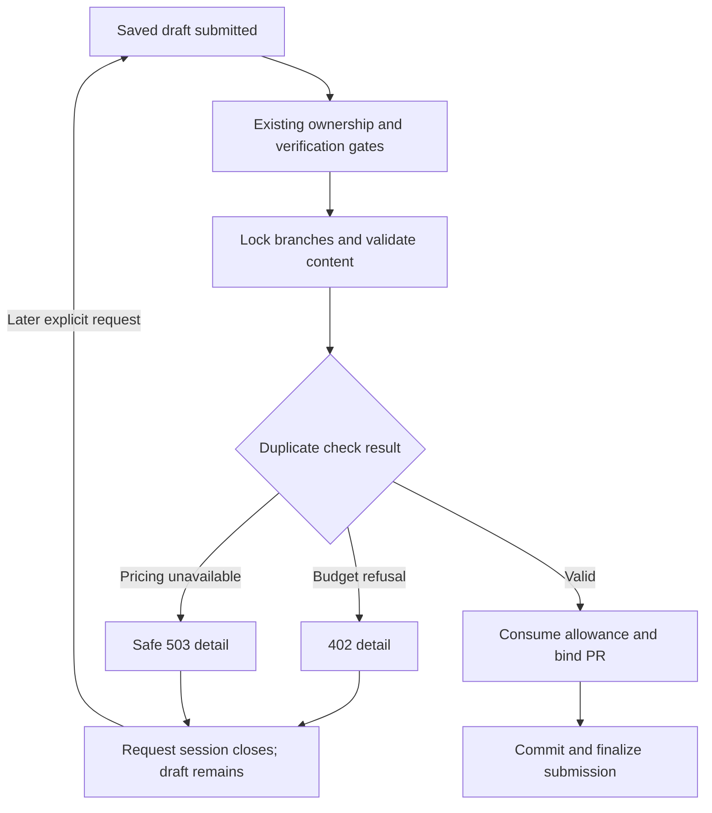

# Submission embedding error recovery - Plan

## Goal Capsule

- **Objective:** Contributors whose suggestion submission encounters a budget or pricing failure receive a recoverable response and retain their saved work for a later retry.
- **Means:** Apply the existing duplicate-check HTTP contract at shared submission validation (KTD1).
- **Authority:** Product requirements govern behavior; technical decisions govern mechanism within those requirements; units and examples cannot amend either.
- **Execution profile:** Bounded API repair, with failing contract tests before production changes and real persistence verification afterward.
- **Stop conditions:** Stop for evidence that requires changed billing policy, added resubmit validation, weakened authorization, or destructive data changes.
- **Delivery owner:** The delivery orchestrator completes review, verification, publication and authorized merge. Matched deployment and live persona acceptance remain D02.

---

## Product Contract

### Summary

Return the established budget/pricing error responses when submission duplicate validation fails, and verify that contributors can retry without losing their draft.

### Problem Frame

Submission calls the paid duplicate checker without translating its two known budget/pricing exceptions. The dedicated duplicate-check endpoint already translates them, while submission currently reaches generic server-error handling. That inconsistency obscures a recoverable failure during a contributor's attempt to send saved work for review.

Current-source research corrects the historical D05 label: resubmit does not call duplicate validation or paid embedding. Adding that behavior would introduce new gates and costs rather than repair an existing exception mapping.

### Requirements

**Error contract**

- R1. Submission validation maps `EmbeddingBudgetExceeded` to HTTP 402 with its existing application message in JSON `detail`.
- R2. Submission validation maps `EmbeddingPricingUnavailable` to HTTP 503 with `detail` equal to `Embedding pricing is unavailable; duplicate check is paused.`; raw pricing exception details are not returned.
- R3. Unrelated exceptions retain their existing failure path, and existing 403/409/422 validation responses remain intact.

**Recovery and compatibility**

- R4. A refused interactive submission preserves saved Git content/head and durable draft status, revision, reviewer feedback and PR linkage; it creates no PR, consumes no submission allowance and triggers no submission finalization, notifications or index refresh.
- R5. A later explicit request can succeed after readiness returns, using fresh request state and creating one PR through the existing successful submission path.
- R6. Paid-call reservations and audit records retain existing semantics, including earlier successful checks before a later refusal; this repair adds no refunds, automatic POST retry or recovery-delay promise.
- R7. Resubmit retains its existing no-paid-validation behavior and revision/feedback transition; shared background submission failures still restore the draft to ACTIVE rather than count as success.
- R8. Existing entity classification, entity cap, trust/mint policy, anonymous restrictions, duplicate distinct-decisions and caller arguments remain unchanged.

### Acceptance Examples

- AE1. Covers R1/R4: a saved active draft with a new labeled class encounters a budget refusal during submit; the response is 402 and a fresh database read after request teardown finds the original draft and no PR.
- AE2. Covers R2/R4/R5: pricing lookup fails, returning the fixed 503 message; once pricing is ready, a new explicit submission succeeds with the same saved branch and exactly one linked PR.
- AE3. Covers R6: one entity check completes paid work before a later check refuses; the draft is recoverable without claiming rollback of the completed call's accounting.
- AE4. Covers R7: a changes-requested suggestion resubmits successfully without invoking duplicate validation, while preserving its existing revision and feedback behavior.

### Scope Boundaries

This deliverable repairs the API contract and proves recovery. It does not introduce provider selection, automatic retry, new billing policy, new resubmit validation, UI messaging changes or a new error envelope.

#### Deferred to Follow-Up Work

D02 owns matched deployment and authenticated persona acceptance. B14 retains schema-taxonomy recognition, historical/untyped policy reconciliation and other cataloged seams. Frontend use of parsed error text is a separate bounded UX follow-up; API transport compatibility alone does not prove polished UI messaging.

### Work Relationships

<!-- ce-section: work-relationships -->

D05 follows integrated D04 (API PR48, merge `c6e552c844f315987f4eb614d04527c4c4a5e5af`) within roadmap requirement B14. D03's web image repair is already integrated. D02 consumes the verified API/web pair after prerequisites. The master web roadmap retains all B01–B75 requirements; this plan covers only the submission error seam.

---

## Planning Contract

### Key Technical Decisions

- KTD1. **Translate at the shared duplicate-check call.** Mirror `ontokit/api/routes/duplicate_check.py` inside `SuggestionService._validate_submission_content`, with narrow catches and exception chaining (R1–R3). This covers existing callers without route-specific duplication or a global exception handler. [FastAPI's error handling](https://fastapi.tiangolo.com/tutorial/handling-errors/#raise-an-httpexception-in-your-code) supports propagation from called service functions.
- KTD2. **Keep transaction ownership at existing boundaries.** Do not add an inner commit or blanket rollback to the mapper (R4–R6). The request's `get_db` session closes on failure; tests must verify durable state from a fresh session because human-verification bookkeeping may autoflush. Preserve independent embedding-accounting transactions. [SQLAlchemy rollback guidance](https://docs.sqlalchemy.org/en/20/orm/session_basics.html#rolling-back) informs fresh-session assertions.
- KTD3. **Keep retry explicit.** Preserve the web client's existing disabled POST retries and omit a speculative `Retry-After` value (R5/R6). [RFC 9110](https://www.rfc-editor.org/rfc/rfc9110.html#section-9.2.2) does not make a non-idempotent operation safe to replay merely because it failed with 503.
- KTD4. **Prove the public seam and persisted workflow separately.** HTTP tests must run the actual submit service and validator, injecting domain failures at the duplicate/embedding boundary; persistence tests must use real PostgreSQL and temporary bare Git repositories (R1–R5). Each HTTP request must create and close its own `AsyncSession`; persisted assertions use a separate session after response teardown. Keep submit, validation, PR claim and binding real. External provider/GitHub effects may be mocked.

### High-Level Technical Design

The flow sequences R1–R6; existing independent paid-call accounting remains outside the draft transaction. Background callers retain their existing claim-and-restore lifecycle under R7.

### Assumptions

The error-contract parity recorded in the roadmap is the intended compatibility boundary. Fresh-request draft recovery is required; no new transaction framework or billing idempotency scheme is assumed. Exact fixture adaptation and any demonstrated persistence defect remain implementation-time discoveries.

### Risks and Dependencies

Baseline is API `dev` at the integrated D04 merge. Locked FastAPI 0.141.1 and SQLAlchemy 2.0.52 need no dependency changes. Real tests need isolated PostgreSQL with project migrations and Redis. A successful prior entity check may remain charged when another check fails (R6); RDF iteration order must not be assumed when testing that case. Background restoration must remain effective despite the mapped exception type (R7).

---

## Implementation Units

### U1. Translate known failures and protect submission ordering

**Goal:** Implement R1–R3 and preserve R6–R8 at the existing shared validation seam.

**Requirements:** R1–R3, R6–R8; AE3/AE4.

**Dependencies:** Integrated D04 baseline.

**Files:** `ontokit/services/suggestion_service.py`; `tests/unit/test_suggestion_submission_content.py`; `tests/unit/test_suggestion_service.py`; `tests/unit/test_embedding_service.py` (verify existing metering-order regressions).

**Approach:**

1. Apply KTD1 at the existing paid check without changing forwarded arguments or the successful result path.
2. Add focused translation and orchestration tests using the established service fixtures.
3. Characterize resubmit and the background failure/restoration path under R7.

**Execution note:** Observe the two domain-error contract tests fail against the baseline before changing production code.

**Patterns to follow:** `ontokit/api/routes/duplicate_check.py`; semantic-search mapping in `ontokit/api/routes/embeddings.py`; existing focused submission and worker fixtures.

**Test scenarios:**

1. Budget refusal returns the R1 status/detail and retains its exception cause.
2. Pricing failure with sensitive-looking internal text returns only the R2 public detail and retains its cause.
3. An unrelated RuntimeError propagates unchanged; existing cap/parse/duplicate/trust regressions remain valid (R3/R8).
4. Failures occur before allowance consumption, PR creation/binding, commit and finalization; relevant orchestration spies are not called (R4).
5. Covers AE3: a later check fails after an earlier successful call; validation stops, without adding rollback/refund or replay behavior (R6). Run the existing mocked metering-order regressions in `tests/unit/test_embedding_service.py`; U2 supplies the separate durable receipt assertion, since mocked reservation/finalization calls cannot prove persistence.
6. Covers AE4: resubmit preserves its response, revision and feedback transition while the duplicate/embedding seam is never called (R7).
7. Each known failure reached by stale-session submission restores ACTIVE and produces no success count (R7).

**Verification:** Focused tests establish both mappings and compatibility boundaries; production lint/type checks pass.

### U2. Prove HTTP recovery and durable draft preservation

**Goal:** Demonstrate R1/R2/R4/R5 across the actual service and persisted workflow.

**Requirements:** R1–R8; AE1/AE2.

**Dependencies:** U1.

**Files:** `tests/integration/test_suggestion_submission_recovery.py` (new); `tests/integration/test_llm_review_regressions.py` and `tests/integration/conftest.py` as fixture patterns; `tests/unit/test_suggestion_service.py` if shared orchestration coverage needs adjustment.

**Approach:**

1. Follow KTD4 with synthetic authenticated identity, real session/project rows and temporary bare repositories.
2. Inject failures below the actual validator; preserve per-request session creation and closure in dependency overrides, then use a separate database session for durable assertions under KTD2. Never yield the same `real_db_session` fixture across failed and retry requests.
3. Restore checker readiness and exercise the normal submission path, retaining real PR persistence while isolating provider/GitHub/network side effects.

**Test scenarios:**

1. Covers AE1/AE2: actual HTTP submit returns each exact status and JSON detail, including safe pricing text.
2. After the failed request closes, assert R4's persistent fields, branch content/head and zero PR count; distinguish independent paid accounting from draft state.
3. Covers AE2: a fresh request succeeds after each failure class, leaves exactly one persisted linked PR and the existing submitted response/state, and performs successful-path side effects once.
4. An untrusted/historical eligible fixture or focused allowance spy demonstrates no allowance use on refusal; a trusted-only fixture is insufficient to establish this boundary.
5. Covers AE3: retain production reservation/finalization functions, complete one mocked-provider paid call before a later validation refusal, and verify its audit record in a fresh PostgreSQL session after request teardown. Do not assume RDF iteration order or mock accounting persistence.
6. Existing verification bookkeeping does not leave a partially submitted durable session when a later validation failure occurs; no commit is added merely to make the fixture pass.

**Verification:** HTTP and real persistence tests pass, then the full API suite and required static checks pass in the locked Python 3.11 environment.

---

## Verification Contract

Use the repository lockfile and isolated test PostgreSQL/Redis, preserving unrelated running services. Focused tests must cover the actual mapper, not a mock that directly returns HTTPException. Record observed pre-fix failures and subsequent passing results.

- `pytest tests/unit/test_suggestion_submission_content.py tests/unit/test_suggestion_service.py tests/integration/test_suggestion_submission_recovery.py -q` proves the new contract and recovery.
- `pytest tests/ -q --cov=ontokit` provides full regression coverage, including D04 mint recognition and embedding accounting.
- `ruff check ontokit/`, `ruff format --check ontokit/`, and `mypy ontokit/` are required; `pyright ontokit/` must remain clean.
- Independent code review and required CI must pass before merge. No live browser or deployment acceptance is inferred from API tests.

---

## Definition of Done

U1's mappings and compatibility tests pass; U2 proves public responses and fresh-request persisted recovery. The full suite and static checks pass without weakening assertions. The reviewed branch is published and merged through normal repository protections, with verification evidence linked from the roadmap. No abandoned implementation attempts remain. B14's remaining seams and D02 live acceptance remain visible.
