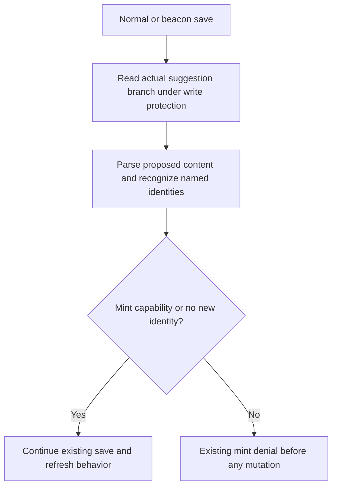

# Schema Mint Authorization - Plan

## Goal Capsule

- **Objective:** Contributors without mint capability cannot create new named schema entities through deprecated-class, deprecated-property, or container-membership declarations.
- **Means:** Extend the existing branch-relative identity detector (KTD1).
- **Authority:** Product behavior belongs to R1–R6; KTDs govern implementation within those requirements. Existing project instructions govern verification and delivery.
- **Execution profile:** Two dependent implementation units with regression-first authorization proof.
- **Stop conditions:** A change to submission billing/caps, a missing safe test database, or evidence that the existing save guard cannot enforce R2 requires resolution before dependent work.
- **Delivery owner:** The executing agent completes review, required CI, focused publication and authorized merge. Hosted activation and persona acceptance remain in D02.

---

## Product Contract

### Summary

Close the three-type schema authorization gap retained by D04. Preserve editing of existing branch identities and the separate submission validation policy.

### Problem Frame

The current mint detector omits subjects whose only declaration is `owl:DeprecatedClass`, `owl:DeprecatedProperty`, or `rdfs:ContainerMembershipProperty`. An untrusted contributor can therefore add those named schema identities without the mint check recognizing an addition. D04 deliberately left this taxonomy follow-up under B14 while fixing named individuals; its [readiness record](../releases/d04-individual-mint-readiness.md) identifies the remainder.

### Requirements

**Mint authorization**

- R1. Recognize named subjects explicitly typed as any of the three schema types named in the Problem Frame when determining newly introduced identities.
- R2. All four suggestion save entry points deny new R1 identities without mint capability before changing Git content/head, persistent session state or refresh work, regardless of the client mint hint.
- R3. Existing recognized suggestion-branch identities remain editable after trust loss, including typing changes in either direction; actors with existing mint capability may create R1 identities.

**Compatibility and evidence**

- R4. Submission duplicate validation, authenticated billing requirements and the 25-new-entity cap retain their existing declaration-classifier behavior.
- R5. Preserve current handling of blank subjects, references, untyped subjects, other structural types, ordinary individuals, malformed Turtle and missing branch baselines.
- R6. Provide executed recognition and real Git/database acceptance evidence, with isolated fixture cleanup and a durable B14 completion record that retains its other unfinished seams.

### Acceptance Examples

- AE1. Covers R1/R2. Given an untrusted contributor's branch without the proposed schema identity, saving a new named subject with any one of the three sole type declarations returns the existing mint-denial response and leaves the whole save unchanged.
- AE2. Covers R3. Given a resumed branch that already contains a subject with one of those declarations, an untrusted contributor can edit its label or replace its type with an ordinary recognized type. Adding a second new schema identity still denies the entire proposal.
- AE3. Covers R4. Given more than 25 newly named schema-only subjects, submission retains its existing classification and billing behavior. Adding ordinary class/property declarations continues to invoke the existing cap and billing rules.

### Scope Boundaries

This deliverable changes explicit declaration recognition and its regression coverage. It introduces no entailment engine, provider integration, dependency upgrade or data migration.

#### Deferred to Follow-Up Work

Other B14 namespace, untyped-resource and historical-branch reconciliation questions remain open. B11–B13 broader authentication, collaboration and browser-CI coverage remain separate, as do B15 Turtle representation work and D02 hosted acceptance.

---

## Planning Contract

### Key Technical Decisions

- KTD1. **Adjust mint exclusions only.** Remove the three R1 types from `_MINT_STRUCTURAL_TYPES` in `ontokit/services/suggestion_service.py`, allowing the existing named typed-subject path to recognize them. Keep `_ENTITY_DECLARATION_TYPES` and `_declared_entities` unchanged for R4, including submission comparison against the default branch. A new shared declaration classifier would unnecessarily couple authorization to paid submission validation.
- KTD2. **Retain the existing guard and branch baseline.** `_assert_branch_content_can_mint` already runs inside branch-write protection before mutation for normal and anonymous saves and the shared beacon flush. Compare against the current suggestion-branch snapshot, not the default branch or identities ever present in history. Extend its existing tests for R2/R3 instead of adding another authorization path.
- KTD3. **Use explicit RDF terms without entailment.** Apply the meanings in the [OWL 2 vocabulary axioms](https://www.w3.org/TR/owl2-rdf-based-semantics/#Axiomatic_Triples_for_the_Vocabulary_Classes) and [RDF Schema container-membership definition](https://www.w3.org/TR/rdf-schema/#ch_containermembershipproperty) to R1. RDFLib 7.6.0 already provides these namespace constants; its [Graph subject iterator](https://rdflib.readthedocs.io/en/7.6.0/apidocs/rdflib.graph/#rdflib.graph.Graph.subjects) supports the existing explicit-triple approach. Standards establish entity meaning, not product permissions or accounting policy.
- KTD4. **Prove denial and compatibility separately.** Extend the current real database/Git denial matrix and add compact persisted allowed-edit cases for R6. Unit controls establish the R4 boundary without making paid external calls.
- KTD5. **Deliver the bounded follow-up serially** (session-settled: user-directed — chosen over planning all areas up front: detailed plans should benefit from earlier delivery while the master roadmap retains remaining work). Both units implement this slice; the wider backlog is not an implementation input for this plan.

### High-Level Technical Design

The existing shared save flow remains authoritative under KTD2; only its identity recognition changes under KTD1.

### Assumptions

- The bounded B14 repair should treat all three explicit schema declarations consistently with existing class/property mint authorization. This is an agent-selected application of the retained D04 follow-up, supported by W3C semantics rather than a newly user-settled policy.
- Existing recognized identities remain editable even if they entered a branch before this repair. Reconciliation of historical admitted content is outside this slice.
- Local authorization acceptance plus reviewed merge completes this code repair; deployment and persona acceptance remain separately tracked.

### Risks and Dependencies

API base `d9272cc8` includes the merged D04 individual-mint repair and D05 submission-error repair. No schema or response-contract changes are needed.

The principal regression risk is expanding `_ENTITY_DECLARATION_TYPES` and changing billing or cap behavior; U1 verifies R4 directly. Testing only new-identity denial could miss editing regressions after trust loss; U2 verifies R3 against persisted branch content. Integration fixtures skip without `DATABASE_URL`, so skipped collection cannot satisfy R6. Use disposable migrated storage and preserve unrelated resources.

### System-Wide Impact

`save`, `save_anonymous`, `beacon_save` and `beacon_save_anonymous` share the affected guard. API clients continue receiving the existing `trust_required_to_mint` denial reason. The change creates no new role, route or frontend behavior. Authorization refusal leaves a proposal containing both a permitted edit and a prohibited addition wholly unchanged under R2. Successful saves retain their existing Git-then-database persistence and partial-failure behavior; this repair adds no cross-store transaction.

---

## Implementation Units

### U1. Recognize schema declarations without changing submission accounting

**Goal:** Implement R1 and establish the R4/R5 boundary.

**Requirements:** R1, R4, R5; AE3; KTD1, KTD3, KTD5.

**Dependencies:** Merged D04/D05 baseline.

**Files:** `ontokit/services/suggestion_service.py`; `tests/unit/test_suggestion_mint_entities.py`; `tests/unit/test_suggestion_submission_content.py`.

**Approach:**

1. Add positive schema-recognition cases where the current structural-negative matrix encodes the omission.
2. Apply KTD1 and clarify the detector's comment to cover named schema identities.
3. Extend submission compatibility controls at the existing content-validator boundary.

**Execution note:** Demonstrate that each positive schema-recognition case fails on the baseline before changing production recognition.

**Patterns to follow:** Existing named-individual recognition tests, set-based subject identity handling and schema-independent submission-content controls.

**Test scenarios:**

1. Each R1 type alone on a named subject is recognized, including prefix aliases and bytes input.
2. Multiple recognized or mixed recognized/structural types on one subject produce one identity.
3. Blank subjects, object-only references, `owl:deprecated true` annotations and ordinary container-membership predicate use do not become declarations.
4. Preserve all remaining structural exclusions and ordinary class/individual recognition controls.
5. Covers AE3. Schema-only new identities beyond 25 retain baseline submission classification, including no billing identity and duplicate labels.
6. Use separate controls for mixed ordinary/schema declarations: 25 classified subjects pass the cap, 26 fail with the existing cap response; missing or anonymous billing identity fails billing; an authenticated classified addition with a duplicate label triggers duplicate refusal. Additional schema-only subjects do not change those outcomes, and multiply typed subjects count once.
7. A default-branch schema-only identity gaining ordinary class/property typing enters existing submission validation; an ordinary classified identity gaining schema typing introduces no submission entity.
8. Malformed Turtle and missing-baseline controls retain their existing errors.

**Verification:** New recognition regressions demonstrate failure before the fix and pass afterward; submission controls show the unchanged R4 boundary. The production diff leaves the submission classifier untouched.

### U2. Prove all save paths preserve authorization and existing edits

**Goal:** Establish persisted denial and compatibility across the affected write paths.

**Requirements:** R2, R3, R5, R6; AE1, AE2; KTD2, KTD4, KTD5.

**Dependencies:** U1.

**Files:** `tests/unit/test_suggestion_trust_integration.py`; `tests/integration/test_llm_review_regressions.py`; `docs/releases/d07-schema-mint-readiness.md`.

**Approach:**

1. Extend the current resumed-session and trusted-creation matrices with the R1 declarations.
2. Extend the real Git/database gate regression and add compact persisted allowed-edit coverage.
3. Record executed checks, cleanup, review/publication evidence and the B14 remainder in the readiness document.

**Patterns to follow:** `TestIndividualSaveBoundaries` and `test_p1_7_p1_12_server_gates_content_before_real_git_commit`, including database refresh and project cleanup assertions.

**Test scenarios:**

1. Covers AE1. Each R1 declaration denies across the existing six writer/hint forms: normal and anonymous saves with false/omitted hints, and both beacons. Check branch bytes/head, existing session fields after database refresh and no refresh enqueue.
2. Covers AE2. A resumed schema identity remains editable after trust loss through all four writers, including replacement with ordinary recognized types.
3. Existing ordinary identities gaining schema typing remain editable; trusted contributors and reviewers retain authenticated creation permission.
4. First schema typing of a previously label-only, reference-only or remaining structural-only subject requires mint capability.
5. Extend the persisted denial fixture with at least one mixed permitted-edit/new-forbidden-identity case per R1 type. Verify unchanged Git bytes/head, refreshed session state and no refresh enqueue; the allowed subset must not persist.
6. Use a compact persisted allowed-edit matrix covering all three R1 types and all four writers, including a schema-to-ordinary typing transition. Seed the identity only on the suggestion branch. For authenticated cases, persist contributor trust revocation and reload member/project state before saving. Confirm source and session updates through fresh reads, respecting each writer’s existing metadata and refresh behavior; only normal authenticated save enqueues refresh.
7. Trusted malformed input still fails parsing; anonymous actors never acquire mint capability from their session credentials; existing missing-baseline behavior remains unchanged.

**Fixture constraints:** Include required RDFS prefixes and keep anonymous payloads below quota. Enter guaranteed committed-project cleanup immediately after database setup, covering subsequent Git setup failure as well as test failure.

**Verification:** The migrated disposable-database suite executes the denial and allowed-edit cases without skips. All affected unit suites and repository checks pass; fixtures are removed and unrelated resources remain intact.

---

## Verification Contract

| Gate | Applies to | Required outcome |
|---|---|---|
| Focused recognition and submission tests | U1 | New recognition cases fail before the production fix; final tests pass and prove R4/R5 |
| Four-writer trust tests | U2 | New creation, resumed edits, hints, trust loss and atomic denial satisfy R2/R3 |
| Real PostgreSQL/Git regression suite | U2 | Migrated isolated database; requested cases execute with no skips and verify persisted outcomes |
| Full `pytest tests/ -v --cov=ontokit` | Final state | All applicable tests execute and pass; coverage and any environment limits are reported |
| Ruff check and format check | Changed Python plus repository gate | No new lint or formatting errors |
| Strict `mypy ontokit/` and `pyright ontokit/` | Final state | Authoritative mypy passes; pyright remains at zero errors |
| Independent review and required CI | Publication | Findings resolved or explicitly blocked; checks pass on the exact published head |

There is no new rendered UI. Browser applicability is assessed against the final diff; an API-only route skip is not a browser pass. No hosted DEV acceptance or deployment is implied by local tests.

---

## Definition of Done

R1–R6 and both units have observed verification evidence. No change expands submission classification or alters billing/caps. The focused branch is reviewed, published and merged after required CI. The readiness record and master roadmap identify completed B14 work and retain every other outstanding requirement. Remove abandoned code, temporary test fixtures and run-owned resources; retain only sanitized durable evidence.
